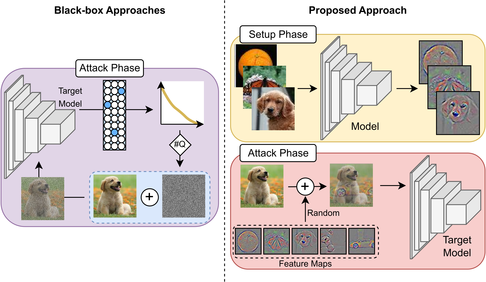
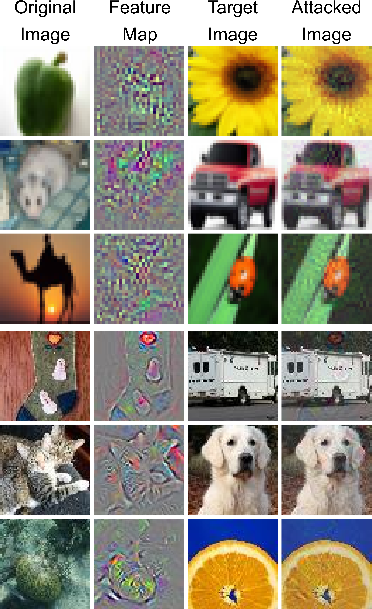

# ZQBA: Zero Query Black-box Adversarial Attack

*Official Pytorch implementation of the [ZQBA: Zero Query Black-box Adversarial Attack]()*

This paper proposes Zero Query Black-box Adversarial (ZQBA) attack, which creates adversarial perturbations using feature maps extracted from various DNNs to fool other networks (target models), without requiring queries or training additional generative models. These feature maps are then combined with the clean images to reduce the target model performance, without impairing image quality, which is evaluated using Structure Similarity (SSIM) that measures the quality of an image according to the perception of the human eye. The results indicate that the generated adversarial samples have transferability between various models and across different datasets, and is competitive with state-of-the-art black-box attacks using a single query.




*Comparison between multiple queries black-box approaches and the proposed black-box attack: Zero-Query Black-box Adversarial (ZQBA) attack. During the attack phase, current black-box attacks query the target model thousands of times to obtain the logits related to the provided images, and adapt a loss function based on the model responses to generate better perturbations. On the other hand, ZQBA has two phases: 1) Setup, where all the feature maps (perturbations) are obtained; and 2) Attack, where previously obtained perturbations are added to the image to be attacked, without querying the target model.*

Performance of multiple architectures on only clean examples on different datasets. Par (M) refers to the number of parameters in millions.

|        Model       | Par (M)   | CIFAR-10  | CIFAR-100 | Tiny      |
|:------------------:|:---------:|:---------:|:---------:|:---------:|
| MobileNetv2        | 3.3       | 85.08     | 57.27     | 45.79     |
| EfficientNetB2     | 8.7       | 84.99     | 58.70     | 58.90     |
| ResNet18           | 11.1      | 94.43     | 69.64     | 55.85     |
| ResNet50           | 24.4      | **96.65** | 78.33     | 63.83     |
| WideResNet28-10    | 36.4      | 89.52     | 56.43     | 48.11     |
| ResNet101          | 42.5      | 96.25     | **78.64** | **63.99** |
| VGG19              | 137.0     | 91.63     | 63.17     | 55.38     |

### Architecture Influence on Attack Performance

Performance of ZQBA in cross-architecture settings in different datasets. MNv2, RN18, RN50, RN101, and WRN refer to MobileNetv2, ResNet18, ResNet50, ResNet101, and WideResNet28-10, respectively. F and T refer to the feature maps and the target model, respectively. $\Delta$ displays the difference between clean and strongest attack (bold) accuracies.

| Dataset  | T/F   | MNv2  | E2    | RN18  | RN50  | WRN   | RN101 | VGG19 | Δ      |
|----------|-------|-------|-------|-------|-------|-------|-------|-------|--------|
|          | MNv2  | 50.39 | 54.22 | 67.27 | 69.18 | 65.35 | 69.91 | 62.43 | -34.69 |
|          | E2    | 53.69 | 54.39 | 67.28 | 68.98 | 65.50 | 69.41 | 62.88 | -31.30 |
|          | RN18  | 73.07 | 74.73 | 78.63 | 81.17 | 74.18 | 81.22 | 75.24 | -21.36 |
| CIFAR-10 | RN50  | 76.22 | 77.19 | 81.33 | 82.00 | 80.26 | 83.50 | 78.61 | -20.43 |
|          | WRN   | 65.57 | 67.05 | 71.83 | 74.98 | 68.71 | 74.79 | 69.52 | -23.95 |
|          | RN101 | 75.33 | 77.28 | 79.05 | 79.73 | 78.66 | 82.53 | 76.04 | -20.92 |
|          | VGG19 | 66.51 | 67.42 | 74.00 | 75.55 | 71.71 | 76.43 | 67.50 | -25.12 |

| Dataset  | T/R   | MNv2  | E2    | RN18  | RN50  | WRN   | RN101 | VGG19 | Δ      |
|----------|-------|-------|-------|-------|-------|-------|-------|-------|--------|
|           | MNv2  | 16.36 | 22.02 | 30.07 | 34.72 | 33.41 | 33.45 | 23.17 | -40.91 |
|           | E2    | 25.82 | 25.87 | 32.98 | 35.34 | 35.43 | 35.07 | 28.53 | -32.88 |
|           | RN18  | 30.18 | 34.20 | 42.16 | 45.29 | 46.86 | 42.31 | 32.16 | -39.46 |
| CIFAR-100 | RN50  | 38.98 | 41.27 | 46.84 | 51.20 | 54.15 | 53.02 | 40.91 | -39.35 |
|           | WRN   | 36.31 | 36.24 | 34.88 | 36.47 | 29.80 | 37.38 | 33.98 | -26.63 |
|           | RN101 | 39.27 | 42.42 | 47.13 | 53.19 | 54.95 | 51.51 | 38.23 | -40.41 |
|           | VGG19 | 30.88 | 31.08 | 37.44 | 41.13 | 38.46 | 39.87 | 27.19 | -35.98 |

| Dataset  | T/R   | MNv2  | E2    | RN18  | RN50  | WRN   | RN101 | VGG19 | Δ      |
|----------|-------|-------|-------|-------|-------|-------|-------|-------|--------|
|               | MNv2  | 16.23 | 22.46 | 25.39 | 26.56 | 26.21 | 25.09 | 25.51 | -29.56 |
|               | E2    | 37.92 | 35.09 | 37.13 | 38.69 | 37.12 | 37.36 | 39.57 | -23.81 |
|               | RN18  | 36.38 | 36.03 | 29.43 | 34.35 | 34.14 | 32.63 | 35.90 | -26.42 |
| Tiny ImageNet | RN50  | 44.49 | 43.31 | 38.59 | 37.72 | 41.60 | 37.09 | 43.53 | -26.74 |
|               | WRN   | 30.58 | 30.87 | 29.52 | 31.92 | 27.86 | 32.32 | 31.90 | -20.25 |
|               | RN101 | 42.73 | 41.29 | 38.06 | 39.46 | 41.62 | 33.06 | 42.41 | -30.93 |
|               | VGG19 | 34.09 | 34.83 | 33.52 | 36.01 | 35.41 | 35.54 | 33.54 | -21.86 |

### Dataset Transferability

Performance of ZQBA in cross-domain settings considering multiple datasets. The top row in the header refers to the dataset used to obtain the feature maps, and the last row in the header refers to the evaluated dataset. The value between parentheses refers to the decrease related to clean accuracy.

| Model | CIFAR-10<br>&darr;<br>Tiny | CIFAR-100<br>&darr;<br>Tiny | Tiny<br>&darr;<br>CIFAR-10 | Tiny<br>&darr;<br>CIFAR-100 |
|-------|----------------------|-----------------------|----------------------|-----------------------|
| MNv2  | 27.60 (40%)          | 27.91 (39%)           | 78.00 (8%)           | 42.54 (26%)           |
| E2    | 40.34 (32%)          | 40.55 (31%)           | 77.12 (9%)           | 44.90 (24%)           |
| RN18  | 38.78 (43%)          | 38.99 (43%)           | 89.39 (5%)           | 55.10 (21%)           |
| RN50  | 47.74 (39%)          | 49.21 (37%)           | 93.04 (4%)           | 66.79 (15%)           |
| WRN   | 31.61 (34%)          | 29.30 (39%)           | 81.80 (9%)           | 36.96 (35%)           |
| RN101 | 49.51 (35%)          | 47.41 (38%)           | 92.43 (4%)           | 66.83 (15%)           |
| VGG19 | 38.37 (31%)          | 37.46 (32%)           | 86.74 (5%)           | 54.18 (14%)           |

### State-of-the-art Comparison

Performance of ZQBA and state-of-the-art black-box attacks, using ResNet model, in different datasets.

| Attack | #Queries | CIFAR-10 | CIFAR-100 | Tiny ImageNet |
|--------|----------|----------|-----------|---------------|
| Square | 1        | 88.47    | 51.55     | 44.03         |
| ZOO    | 1        | 94.43    | 69.63     | 67.78         |
| ZQBA   | 0        | 78.63    | 42.16     | 29.43         |

### Qualitative Analysis of ZQBA



*Original Image, Feature Map, Target Image, and Attacked Image for CIFAR, in the first three rows, and Tiny ImageNet, in the last three rows. The Original Image refers to the image used to obtain the Feature Map, the Target Image is the one whose classification the attacker is trying to change, and the Attacked Image is the combination of the Feature Map and the Target Image.*

## Cite

```bibtex

```
